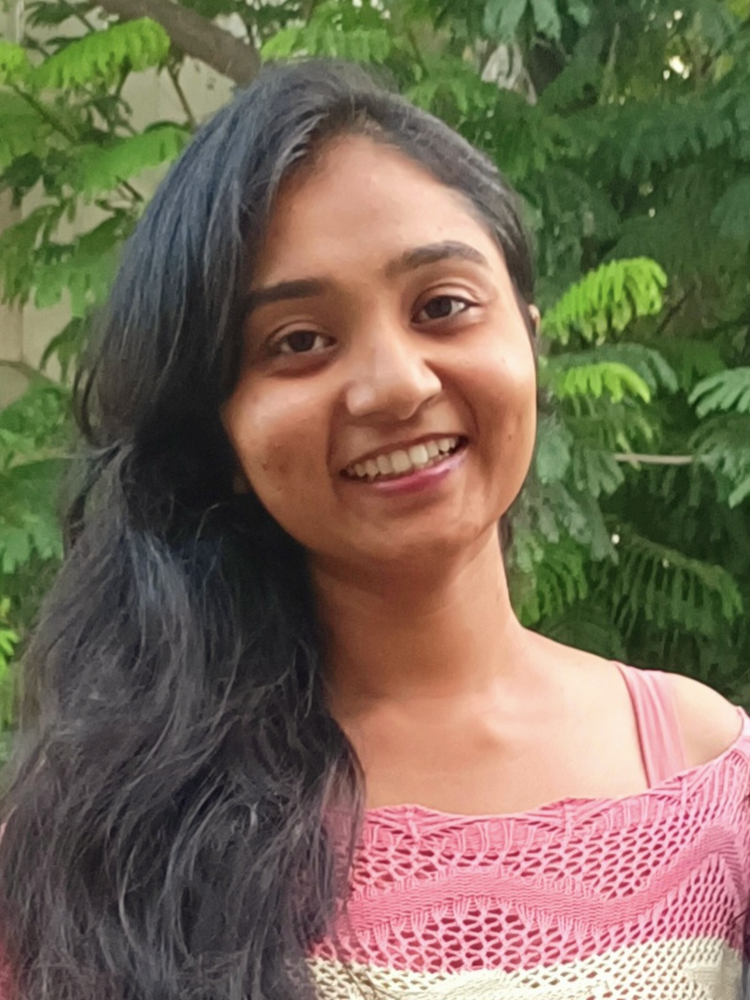
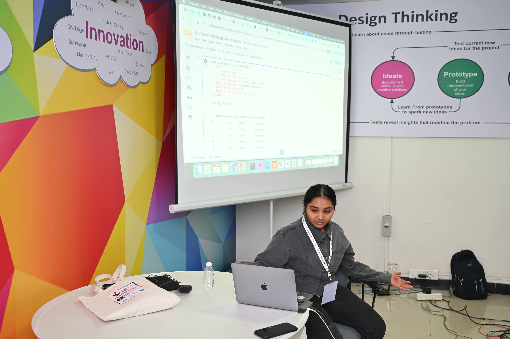

---
hide:
  - toc
---
<!--
CHECKLIST FOR THIS PAGE:
- [ ] Replace [YOUR NAME] with your full name (3 places)
- [ ] Replace [YOUR JOB TITLE] with your current or target role
- [ ] Replace [YOUR TAGLINE] with a short phrase describing your focus
- [ ] Rewrite the About Me paragraph with your own words
- [ ] Replace assets/images/profile.png with your actual photo (keep the filename or update it below)
- [ ] Replace assets/images/about.png with your own image (a field photo, map, or workspace shot)
- [ ] Edit the skill cards to match your actual skills (add, remove, or rename cards as needed)
- [ ] Update GitHub and LinkedIn links in the Connect section
- [ ] Add your CV PDF to docs/assets/ and update the filename in the Download CV button
-->

  
  <h1>Vigna Purohit</h1>
  
<strong>GIS Professional</strong>

  
<em>Putting the "special" in spatial</em>

---

## About Me

I bring a diverse professional background, having worked across research organizations, corporate environments, and
educational institutions. My experience spans collaborative team settings, as well as hands-on involvement with startups,
where I gained valuable insights into both field-related work and administrative logistics. With a passion for leveraging remote
sensing and GIS technologies, I am eager to explore innovative applications through the adoption of cutting-edge techniques
and the development of streamlined workflows. I am currently seeking opportunities as GIS Professional in Tallinn, Estonia.

  

---

[View My Projects :material-arrow-right:](projects/index.md){ .md-button .md-button--primary }
[Download CV :material-download:](assets/Vigna-CV.pdf){ .md-button }

---

## Skills

-   :material-layers:{ .lg .middle } **GIS & Remote Sensing**

    ---

    - QGIS, GDAL, Python
    - Google Earth Engine
    - Cloud Native Geospatial 

-   :material-code-braces:{ .lg .middle } **Programming**

    ---

    - Python — GeoPandas, NumPy, Pandas, Matplotlib
    - SQL
    - PyQGIS

-   :material-star-four-points:{ .lg .middle } **Machine Learning & GeoAI**

    ---

    - Supervised classification — Random Forest, XGBoost
    - Deep learning for image segmentation — U-Net, SAM
    - scikit-learn, PyTorch, TensorFlow
    - Object detection in satellite imagery

-   :material-earth:{ .lg .middle } **Web Mapping & Data**

    ---

    - Cloud storage — AWS S3, Google Cloud Storage
    - Data formats — GeoTIFF, GeoParquet, NetCDF
    - Streamlit for data-driven web apps

-   :material-database:{ .lg .middle } **Data & Cloud**

    ---

    - PostgreSQL + PostGIS, DuckDB
    - Cloud storage: AWS S3, Google Cloud Storage
    - Data formats: GeoJSON, GeoTIFF, NetCDF, Zarr, GeoParquet
      

---

## Connect

[GitHub]([https://github.com/[YOUR-GITHUB-USERNAME]](https://github.com/VignaPurohit)){ .md-button }
[LinkedIn]([https://linkedin.com/in/[YOUR-LINKEDIN-USERNAME]](https://www.linkedin.com/in/vigna-purohit-666838150/)){ .md-button }
