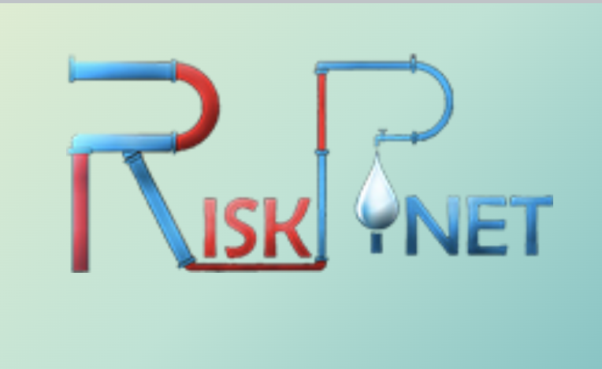

<!--
CHECKLIST FOR THIS PAGE (copy this file for each new project):
- [ ] Replace [YOUR PROJECT TITLE] with your project title
- [ ] Replace the hero image with your own (add to docs/assets/images/)
- [ ] Update the Overview section
- [ ] Update the Methods & Tools section
- [ ] Update the Key Findings section
- [ ] Update the Links section
- [ ] Add a card for this project on docs/projects/index.md
- [ ] Add a nav entry in mkdocs.yml
-->

# RISK-PiNET

## Links

[Documentry by CSIR-NEERI](https://www.youtube.com/watch?v=_wOkgtaXMxM){ .md-button }
[Team](https://riskpinet.wordpress.com/){ .md-button }
